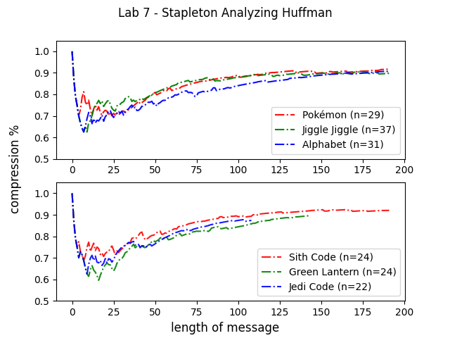

# Lab 7 - Analyzing Huffman Encoding

## Objectives

- Implement the Huffman tree algorithm
- Encode a set of lyrics and mantras
  - 3 lyrics
  - 3 mantras
- Plot the compression ratio of both sets

# Lyrics

1. Pokémon Theme Song
2. Jiggle Jiggle
3. Alphabet Aerobics

# Mantras

1. Jedi Code
2. Green Lantern's Oath
3. Sith Code

## Part A) Huffman Tree

1. Define Data Structures and __init__ for **Node** Class
The Nodes should have some sort of identifier as to what letter they are representing and how often that letter appears in the message
3. Step 1: Given the message, count the frequencies into the  
**freq** dictionary
3. Step 2: Initialize the nodes based off the letter and frequency
4. Step 3: Combine each node until there is only one item in the node list. May want to write a function for this 
5. Step 4: Reconstruct the nodes that result from the **coding** dictionary that should be populated by your code
## Part B) Analysis

1. Similar to Part A, complete Steps 1-4 listed in the document. Copy the code you wrote in Part A to Part B to test your program. 

## Report (300 words)

For your (i) songs and (ii) mantras, how can you describe compression performance from Huffman?

Consider the following:
- the length of your messages
- the frequencies of each letter in your messages
- the unique vocab words, etc.

And, how the above influences a Huffman Tree in the following ways:
- height
- balanced-ness
- searching
- etc.

200 words for (i) and 100 words for (ii).

## Submission

GitHub Classroom
